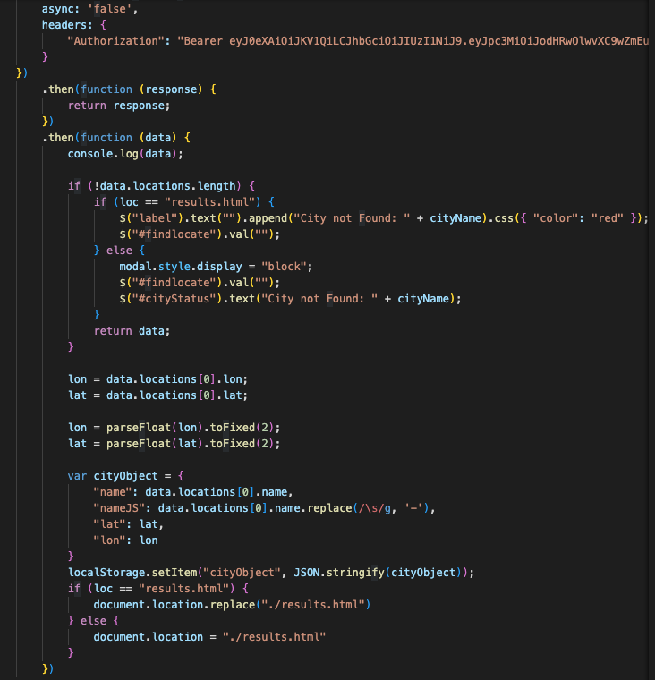
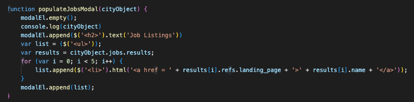

# City Grader

[Deployed application](https://joedjensen.github.io/neighborhood-grader/)

## Description
This repository contains a website that utilizes multiple third-party APIs in order to provide users with a holistic score for a desired city, as well as access to detailed information. Users can input a city name, and the application aggregates and displays a variety of data related to different elements of day-to-day life in and around that city. It does this by drawing information from several different APIs, storing the relevant data in local storage, and rendering that information into cards on a page. In addition to the cards, the overall score is meant to account for each data point and offer an easy point of comparison for users.  
The application also includes several features to provide the user with additional interactive elements. It offers users the ability to display multiple cities at once, and will dynamically adjust the elements on the page in order to provide a side-by-side, easily comparable view of each entry. Clicking on any of the individual cards generates a modal with additional information, also drawn from the various APIs. The card containing the overall score is flippable, with the reverse side containing some information about the score and a suggestion the user try to interact with the rest of the page.

---

## Usage
Search for a location of interest. A results page will load with information on the weather, open jobs, and entertainment events in the area.

Once on the results page, click the '+' button to add an additional city to the page. Click the 'x' on an element to remove it from the page. Click on each of the cards for additional detailed information.

---

## Code Snippets
Local storage is used to pass an object from the search page to the results page. The data from that object is then used to generate the fetch requests for the APIs.  
  

The modals that appear when individual cards are clicked are populated by the same object the as the cards--it contains all of the necessary information so that it can be quickly rendered when called.

## Contributors
[Joe Jensen](https://github.com/joedjensen)  
[Jonathan Moreno](https://github.com/johnfrom209)  
[Bradley DiLollo](https://github.com/bdilollo)

---

## License
[MIT](/LICENSE) &#124; 2022